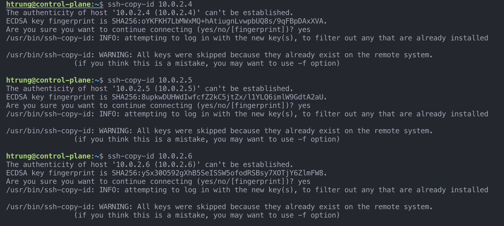

# Project Overview 
This project is a concept of Infrastructure as Code and to Provision VMs on Azure 

## Project Goal
- Understand Infrastructure as Code Concept (Terraform, Ansible)
- Learning Azure
- Use for further projects 

# Diagram 


# Instruction
## Clone
Generate ssh-key, private key must be stored in /ansbile 
```bash
  git clone https://github.com/htrungngx/GitOps_Project.git 
  cd GitOps_Project
```
1. Preparation

    Genarate ssh key
    ```bash
      ssh-keygen -b 4096 -t rsa -f $HOME/GitOps_Project
    ```
    Grant permission for keys
    ```bash
      chmod 400 key_name
    ```

    Edit keys in tfvars file

    
    
2. Terraform

    Provisioning infrastructure in Azure

        ```bash
          terraform init
          terraform plan
          terraform apply --auto-approve #Creating without approval
        ```
    
    Result

    

3. Setting up

    Connect to VM (master)

    ```
        ssh -i private-key user@public-ip 
    ```

    Setup ansible 
    ``` 
      ssh-agent bash
      ssh-add /home/k8s/ansible/private_key.pem
      ssh-copy-id <ip_private_worker1,2>
    ```
    

    Check ansible inventory, replace ip-address of each VMs and execute
    ```
      sed -i "s+cp ansible_host=control_plane_ip+cp ansible_host=**ip**+g" ./ansible/inventory
      sed -i "s+worker1 ansible_host=worker_1_ip+worker1 ansible_host=**ip**+g" ./ansible/inventory
      sed -i "s+worker2 ansible_host=worker_2_ip+worker2 ansible_host=**ip**+g" ./ansible/inventory
    ```

    Check ansible's connection
    ```
      ansible -i ./ansible/inventory -m ping all
    ```
    Install dependencies
    ```
      ansible-playbook -i inventory install_kube_dependenci.yml
    ```
    Create cluster on master 
    ```
      ansible-playbook -i inventory create_cluster.yml
    ```
    Join cluster
    ```
      ansible-playbook -i inventory join_cluster.yaml
    ```
    

    Result

    

3. Install ArgoCD

    Install
    ```
      kubectl create namespace argocd
      kubectl create namespace deploy-argocd
      kubectl apply -n argocd -f https://raw.githubusercontent.com/argoproj/argo-cd/stable/manifests/install.yaml
    ```
    Install argo-cd CLI
    ```
      sudo curl -sSL -o /usr/local/bin/argocd https://github.com/argoproj/argo-cd/releases/latest/download/argocd-linux-amd64
      sudo chmod +x /usr/local/bin/argocd
    ```
    Get password argocd
    ```
    kubectl -n argocd get secret argocd-initial-admin-secret -o jsonpath="{.data.password}" | base64 -d; echo
    ```
    Login via browser (http://master-public-ip)

    Credential
    >admin
    
    >password (Get from previous step)


## Troubleshooting
1. Ansible can not ping to master, workers

    

    >Occurs everytime turnoff ansible or VMs => Re-run command from steps 3.1-3.2
    >Config wrong private-ip-address of master,workers => Step 3.3 

2. Can not access to Argocd-cli
    

    >argocd does not expose  external IP event it's running => Using port forwarding 
      ```
      kubectl port-forward svc/argocd-server -n argocd 8080:443 --address 0.0.0.0 
      ```


   